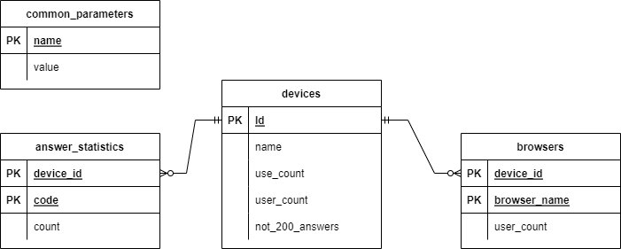

# Cкрипт для формирования витрины на основе логов web-сайта

## Задача

Разработать скрипт формирования витрины следующего содержания:

1. Суррогатный ключ устройства
1. Название устройства
1. Количество пользователей
1. Доля пользователей данного устройства от общего числа пользователей.
1. Количество совершенных действий для данного устройства
1. Доля совершенных действий с данного устройства, относительно других устройств
1. Список из 5 самых популярных браузеров, используемых на данном устройстве различными пользователями, с указанием доли использования для данного браузера относительно остальных браузеров.
1. Количество ответов сервера отличных от 200 на данном устройстве
1. Для каждого из ответов сервера, отличных от 200, сформировать поле, в котором будет содержаться количество ответов данного типа

Пример файла лога: [https://disk.yandex.ru/d/BsdiH3DMTHpPrw]https://disk.yandex.ru/d/BsdiH3DMTHpPrw)

## Выбор стека технологий

Для решения задачи воспользуемся изыком программирования Python. Выбор обусловлен тем, что он поставляется в большинстве дистрибутивов Linux как один из инструментов по умолчанию. Это позволит запускать обрабтку лога прямо на web-сервере. Так же Python имеет мощные встроенные средства для работы с текстом и обширный набор подключаемых модулей.

В качестве хранилища данных для формирования витрины данных можно исползовать что угодно, но аналитики любят SQL. Поэтому используем PostgreSQL.

Применение более развитых технологий обрабтки данных (Spark, Hadoop и пр.) целесообразно только при необходимости обработки логов размером в 100 Гб и более. Применение компилируемых языков программирования (C, C#, Java, Scala и пр.) может позволить ускорить обработку данных, но тогда може возникнуть проблема оперативной модификации алгоритма обратки и устанвоки дополнительных библиотек, языковых средств.

## Реализация скрипта обработки логов

### Алгоритм работы

1. Прочитать из файла лога строку
2. Выполнить разбор строки по полям
3. Выполнить разбор полей
4. Выполнить обработку разобранной строки
5. Если файл закончился, то перейти к 6, иначе к 1
6. Выполнить обобщение обработанных строк
7. Записать результат в файл

### Разбор строк файла лога

Разбирать стоки файла по полям будем с помощью регулярных выражений.

Строка входного файла лога записана в формате:

```
40.77.167.129 - - [22/Jan/2019:03:56:17 +0330] "GET /image/23488/productModel/150x150 HTTP/1.1" 200 2654 "-" "Mozilla/5.0 (compatible; bingbot/2.0; +http://www.bing.com/bingbot.htm)" "-"
```

Указанный формат соответсвует конфигурации журнала Apache: `%h %l %u %t \"%r\" %>s %b \"%{Referer}i\" \"%{User-agent}i\"`, где:
* `%h` - IP клиента
* `%l` - "-" в выводе указывает на то, что часть запрошенной* `информации недоступна.
* `%u` - Пользователь, если авторизовался
* `%t` - время запроса
* `\"%r\"` - запрос, адрес, протокол
* `%>s` - код результата ответа
* `%b` - размер ответа
* `\"%{Referer}i\"` - источник запроса
* `\"%{User-agent}i\"` - идентикатор браузера

Разбить на поля данный формат можно с помощью регулярного выражения:

```
"^(?P<IP>\S*)\s(?P<I>.)\s(?P<User>\S*)\s\[(?P<Time>.*)\]\s\"(?P<Method>\S*)\s(?P<Address>\S*)\s(?P<Protocol>[^\"]*)\"\s(?P<Status>\S*)\s(?P<Size>\S*)\s\"(?P<Referrer>[^\"]*)\"\s\"(?P<UA>[^\"]*)\"\s\"(?P<Addition>[^\"]*)\"$"
```

При необходимости его можно изменить в файле [apache_log_parser.py](src/log_parser/apache_log_parser.py)

### Разбор содержимого полей 

Разбору поделжат всего два параметра:

1. Уникальный идентификатор пользователя
2. Информация о агенте:
	* Название и версия браузера
	* Название и версия ОС
	* Название устройства

Данный разбор произволится после применения регулярного выражения и выполняется в файле [apache_log_parser.py](src/log_parser/log_entity.py)

Уникальный идентфикатор пользователя представляет собой IP адрес и имя пользоваля, если он был авторизован web-сервером.

Информацию о агенте получим с помощью библитеки разбора [user_agents](https://pypi.org/project/user-agents/)

### Обработка разобранной строки 

Подсчет необходимых для витрины параметров будем производить "на лету", т.е. по мере чтения и разбора файла лога. 

Алгоритмы обработки строки представлены в файле [log_processor.py](src/log_parser/log_processor.py). Здесь передача каждой новой строки в метод `process_log_entity` выполняет:

1. Подсчет количества обработанных строк
2. Подсчет количества поисковых ботов
3. Добавление информации устройствах по мере нахождения новых
4. Сбор информации о пользователях устройств
5. Сбор информации о браузерах, используемых на устройствах
6. Сбор информации о кодах ответов сервреа по устройствам

### Обобщение результатов и запись в файл

Данная операция необходима, т.к. для витрины данных не нужны списки пользователей или какая-либо служебная информация. Поэтому перед записью данных в файл формируется аггрегированная структура данных в формате JSON:

```
{
    "log_count": int - количество обработанных записей,
    "error_count": int - количество необработанных записей,
    "bot_count": int - количество роботов в журнале,
    "user_count": int - количество уникальных пользователей (IP) исключая роботов,
    "devices": {
        "Linux": { // - название устройства или ОС
            "use_count": int - количество записей, относящихся устройству,
            "use_share": float - отношение количества записеустройства ко всем записям,
            "user_count": int - количество уникальных пользователе(IP) устройства,
            "user_share": float - отношение количества уникальныпользователей (IP) устройства ко всем пользователям,
            "not_200_answers": int - количество статустов ответотличных от 200,
            "browsers": [ // - браузеры
                [
                    "AhrefsBot 6.1", // нзвание браузера
                    354 // количестово уникальны
                ],
            ],
            "request_answers": {
                "404": int - количество статустов ответа,
            },
        },
    }
}
```

### Формирование витрины данных в PostgreSQL

Для загрузки обощенного файла результатов разбора логов используется специальный загрузчик, который подключается к СУБД, формирует схему данных и загружает данные.

Схема данных БД показана на рисунке ниже.



## Использование скрипта

Установка зависимостей:

```
pip install -r ./src/requirements.txt
```

Запуск скрипта разбора:

```
python3 ./src/log_parser/main.py /var/log/apache2/access.log /home/admin/result.json 4
```

Здесь:

* `/var/log/apache2/access.log` - путь к файлу лога
* `/home/admin/result.json` - путь к файлу результата
* `4` - количество параллельных обработчиков

Запуск скрипта формирования витрины данных:

```
python3 ./src/data_mart_creator/main.py /home/admin/result.json
```

Здесь:

* `/home/admin/result.json` - путь к файлу результата

Конфигурация подключения к БД (файл `src/data_mart_creator/config.py`):

```
DB_NAME = "ApacheLog" # Имя БД
DB_USER = "postgres" # пользователь БД
DB_PASSWORD = "postgres" # пароль БД
DB_HOST = "localhost" # адрес сервера БД
```

## Формирование витрины данных

Все данные для формирования витринных данных доступы в JSON файл результата обработки лога. При необходимости возможно получение данных их БД с помощью запроса:

```
SELECT ID,
	NAME,
	USE_COUNT,
	USE_COUNT /
	(SELECT VALUE
		FROM PUBLIC.COMMON_PARAMETERS
		WHERE NAME = 'log_count') AS USE_SHARE,
	USER_COUNT,
	USER_COUNT /
	(SELECT VALUE
		FROM PUBLIC.COMMON_PARAMETERS
		WHERE NAME = 'user_count') AS USER_SHARE,
	NOT_200_ANSWERS,
	ARRAY
	(SELECT BROWSER_NAME
		FROM PUBLIC.BROWSERS
		WHERE DEVICE_ID = ID
		ORDER BY USER_COUNT DESC
		LIMIT 5) AS BROWSERS,
	ARRAY
	(SELECT CODE || ': ' || COUNT
		FROM PUBLIC.ANSWER_STATISTICS
		WHERE DEVICE_ID = ID
		ORDER BY COUNT DESC) AS ANSWERS
FROM PUBLIC.DEVICES;
```

Здесь:

* `ID` - Id устройства
* `NAME` - Название устройства
* `USER_COUNT` - Количество пользователей
* `USER_SHARE` - Доля пользователей данного устройства от общего числа пользователей
* `USE_COUNT` - Количество совершенных действий для данного устройства
* `USE_SHARE` - Доля совершенных действий с данного устройства, относительно других устройств
* `BROWSERS` - Список из 5 самых популярных браузеров, используемых на данном устройстве различными пользователями, с указанием доли использования для данного браузера относительно остальных браузеров
* `NOT_200_ANSWERS` - Количество ответов сервера отличных от 200 на данном устройстве
* `ANSWERS` - Количество всех ответов, отличных от 200

В результате выполнения зпроса получим таблицу вида:

| id   | name                                             | use_count | use_share | user_count | user_share | not_200_answers | browsers                                                                                                                                    | answers                                                                                                                                           |
|------|--------------------------------------------------|-----------|-----------|------------|------------|-----------------|---------------------------------------------------------------------------------------------------------------------------------------------|---------------------------------------------------------------------------------------------------------------------------------------------------|
| 1    | Spider                                           | 1109418   | 0         | 3522       | 0          | 393645          | {"BingPreview 1.0","AhrefsBot 6.1","bingbot 2.0","Baiduspider 2.0","Googlebot 2.1"}                                                         | {"304: 283460","302: 52357","301: 41733","404: 13940","499: 987","403: 810","502: 250","500: 45","504: 37","400: 26"}                             |
| 2    | ALE-L21                                          | 18627     | 0         | 1670       | 0          | 448             | {"Android 6.0","Chrome Mobile 50.0.2661","Android 5.0.1","Chrome Mobile 46.0.2490","Chrome Mobile 66.0.3359"}                               | {"302: 181","499: 106","304: 101","403: 43","301: 17"}                                                                                            |
| 3    | Windows 8                                        | 119296    | 0         | 1032       | 0          | 1587            | {"Firefox 16.0","Chrome 71.0.3578","Firefox 64.0","IE 10.0","Opera 57.0.3098"}                                                              | {"301: 556","302: 538","499: 213","304: 162","404: 70","403: 18","502: 16","500: 14"}                                                             |
| 4    | HTC Desire 728 dual sim                          | 490       | 0         | 70         | 0          | 22              | {"Android 5.1","Chrome Mobile 71.0.3578","Chrome Mobile 50.0.2661","Chrome Mobile 69.0.3497","Chrome Mobile 55.0.2883"}                     | {"302: 6","304: 6","499: 6","301: 2","403: 2"}                                                                                                    |
| 5    | Linux                                            | 51362     | 0         | 607        | 0          | 2152            | {"Chrome 71.0.3578","Chrome 49.0.2623","Chrome 11.0.696","Chrome 38.0.2125","Chrome 70.0.3538"}                                             | {"302: 1123","301: 683","304: 123","499: 113","404: 83","403: 18","502: 7","400: 2"}                                                              |
| 6    | Samsung SM-G950F                                 | 35982     | 0         | 2182       | 0          | 1200            | {"Android 8.0.0","Chrome Mobile 71.0.3578","Samsung Internet 8.2","Chrome Mobile 68.0.3440","Chrome Mobile 70.0.3538"}                      | {"302: 586","304: 249","499: 239","403: 81","301: 32","404: 6","502: 4","408: 3"}                                                                 |
| 7    | Windows 10                                       | 1590600   | 0         | 13678      | 0          | 70027           | {"Chrome 71.0.3578","Firefox 64.0","Edge 17.17134","Opera 57.0.3098","IE 11.0"}                                                             | {"302: 34828","500: 12663","304: 10697","499: 7947","404: 2848","301: 615","502: 204","401: 102","403: 87","504: 19","408: 10","405: 6","400: 1"} |
| 8    | Generic Smartphone                               | 155157    | 0         | 4031       | 0          | 6004            | {"Firefox Mobile 64.0","Firefox Mobile 63.0","Firefox Mobile 62.0","Firefox Mobile 61.0","Firefox Mobile 59.0"}                             | {"304: 2838","302: 1876","499: 1000","301: 111","403: 104","404: 75"}                                                                             |
| 9    | iOS-Device                                       | 81101     | 0         | 8724       | 0          | 55989           | {"torob 5","MobileSafari 604.1","MobileSafari 602.1","off-er 2","MobileSafari 601.1"}                                                       | {"404: 55781","403: 176","301: 13","499: 10","302: 4","502: 4","408: 1"}                                                                          |
| 10   | Samsung SM-G900H                                 | 29067     | 0         | 1726       | 0          | 717             | {"Android 6.0.1","Chrome Mobile 71.0.3578","Samsung Internet 8.2","Samsung Internet 4.0","Android 5.0"}                                     | {"302: 314","499: 178","304: 130","403: 75","301: 16","404: 4"}                                                                                   |


## Быстродействие

Быстродейтсвие оценивалось временим обработки файла access.log объемом 3.26 ГБ на разном количестве (1-20) паралельных обработчиков.

Аппаратная платформа для оценки быстродействия:

```
CPU:           Intel Core i7-12700K (Alder Lake-S 841, C0)
               3600 MHz (36.00x100.0) @ 4800 MHz (48.00x100.0)
			   E-core: 4C/4T | P-core: 8C/16T
Motherboard:   ASUS PRIME Z690-P D4
BIOS:          0603, 11/01/2021
Chipset:       Intel Z690 (Alder Lake-S PCH)
Memory:        32768 MBytes @ 3200 MHz, 16-18-18-36
               - 16384 MB PC25600 DDR4 SDRAM - Kingston KF3200C16D4/16GX
               - 16384 MB PC25600 DDR4 SDRAM - Kingston KF3200C16D4/16GX
Graphics:      Intel UHD Graphics 770 (Alder Lake-S 881 GT1) - Integrated Graphics Controller [ASUS]
               Intel UHD Graphics 770, 1024 MB 
Drive:         TOSHIBA HDWD130, 2930.3 GB, Serial ATA 6Gb/s @ 6Gb/s
Drive:         TOSHIBA HDWD130, 2930.3 GB, Serial ATA 6Gb/s @ 6Gb/s
Drive:         MSI M470 1TB, 976.8 GB, NVMe
OS:            Microsoft Windows 11 Professional (x64) Build 22000.1219 (21H2)

```

Для автоматизированного получения результатов тестирования использовтался скрипт [PowerShell](src/performance_test.ps1).

Результаты работы скрипта представлены в таблице. Из нее видно, что на физических ядрах производительность растет линейно.

| Количество обработчичков (потоков)  | Время, мин   |  Ускорение | Средняя скорость чтения файла, МБ/с |
|----|-------|------|-------|
| 1  | 12,98 | 1,00 | 4,29  |
| 2  | 6,77  | 1,92 | 8,22  |
| 3  | 4,57  | 2,84 | 12,17 |
| 4  | 3,64  | 3,57 | 15,28 |
| 6  | 2,45  | 5,30 | 22,71 |
| 8  | 1,88  | 6,90 | 29,59 |
| 10 | 1,68  | 7,73 | 33,12 |
| 12 | 1,54  | 8,43 | 36,13 |
| 16 | 1,37  | 9,47 | 40,61 |
| 20 | 1,34  | 9,69 | 41,52 |

Ускорить работу можно уменьшив количество операций разбора за счет отказа от предварительной обработки неиспользуемых данных.

Например, в текущем задании ничего не говорится о важности временных отметок, а их разбор занимает существенное время. Поэтому возмно в файле ["apache_log_parser.py"](src/log_parser/apache_log_parser.py) убрать разбор даты заменив строки:
```
# 22/Jan/2019:03:56:17 +0330 -> 22/Jan/2019 03:56:17 +0330
time = date_parse(time[:11] + " " + time[12:])
time = time.timestamp() # время в формате unix timestamp (int)
```

на 
```
time = 0
```

Результаты работы скрипта без разбора дат представлены в таблице ниже. Скорость обработки выросла существенно (примерно в 2.5 раза).

| Количество обработчичков (потоков)  | Время с датами (А), мин | Время без дат (Б), мин  | Ускорение (А/Б) | Средняя скорость чтения файла, МБ/с |
|----|-------|------|------|--------|
| 1  | 12,98 | 4,75 | 2,73 | 11,71  |
| 2  | 6,77  | 2,53 | 2,68 | 21,99  | 
| 3  | 4,57  | 1,80 | 2,54 | 30,91  | 
| 4  | 3,64  | 1,46 | 2,49 | 38,11  | 
| 6  | 2,45  | 1,00 | 2,45 | 55,64  | 
| 8  | 1,88  | 0,80 | 2,35 | 69,55  | 
| 10 | 1,68  | 0,70 | 2,40 | 79,48  | 
| 12 | 1,54  | 0,66 | 2,33 | 84,30  | 
| 16 | 1,37  | 0,58 | 2,36 | 95,93  | 
| 20 | 1,34  | 0,5  | 2,68 | 111,27 |